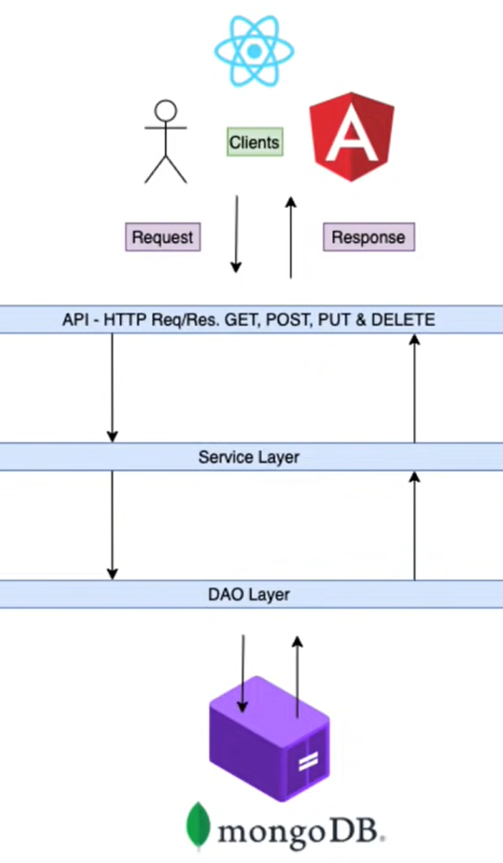

# Spring-Boot-REST-API

<b>Configuration</b> 
- Project : Maven  
- Language : Java  
- Spring Boot Version : 2.6.2  
- Packaging : Jar  
- Java : 11

<b>Dependencies</b>
- Lombok
- Spring Web
- Spring Data MongoDB 

<b>Basic Flow</b> 

